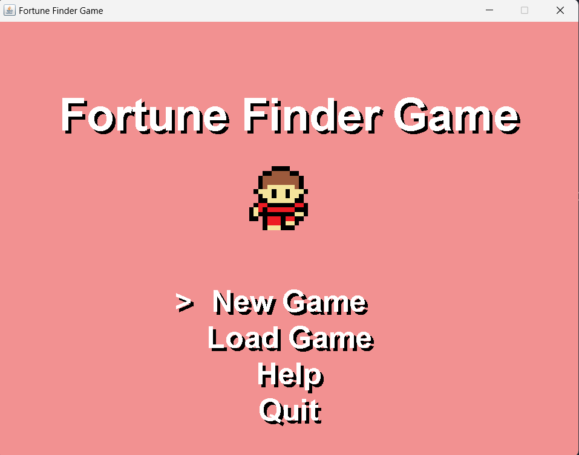
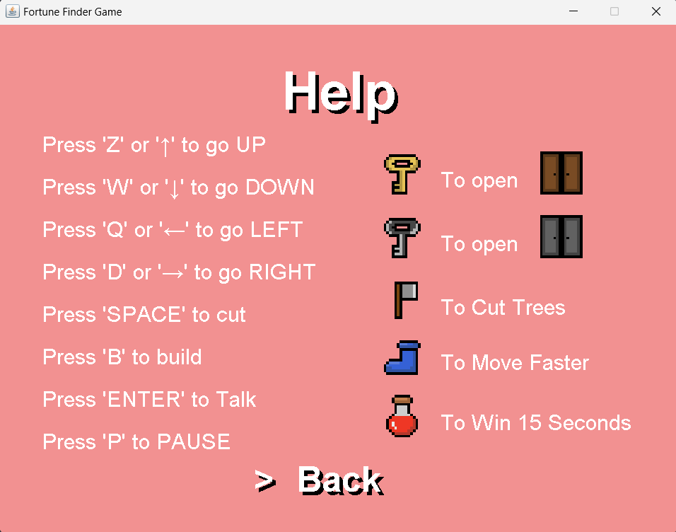

# Fortune Finder Game

A simple Java-based 2D adventure game where players explore and search for hidden treasures, overcoming obstacles and solving puzzles along the way.    

***

> Table of Contents
1. Overview
2. Installation
3. Usage
4. Screenshots
5. Technologies Used
6. Contributing
7. Contact

***

## Overview
Fortune Finder is a Java-based 2D adventure game that takes players on an exciting quest to discover hidden treasures across various levels. Navigate through obstacles, solve puzzles, and avoid traps as you explore mysterious locations filled with challenges. The game utilizes Java's standard libraries for graphics, providing an engaging gameplay experience.

## Installation
To set up the Fortune Finder game locally, follow these steps:   

  1. Clone the Repository:
  ```
  git clone https://github.com/AkramNsir/FortuneFinderGame.git
  ```

  2. Ensure you have Java installed on your system:
  3. Go to .java files location:   
   ```
  cd src
  ```

  4. Compile the Java files:
  ```
  javac -encoding UTF-8 -d ..\bin tile/*.java object/*.java main/*.java entity/*.java
  ```

## Usage
  1. Go back to the main directory:
  ```
  cd ..
  ```

  2. Run the game:
  ```
  java -cp bin Main.Main
  ```

  3. Gameplay: Use the keyboard to control your character, explore the game world, collect keys, and solve puzzles to find the treasure.

## Screenshots 
Here are some screenshots of FortuneFinderGame project:

### Land Page


### Scores Page


### Help Page 


### Game Satrt 


### Game End 


## Technologies Used
<div style="display: flex; gap: 20px; flex-wrap: wrap;">

* <div style="background-color:blue;color:white;border-radius:5px;padding:10px;margin:5px;">
     Java
  </div>

</div>

## Contributing
Contributions to FortuneFinderGame are welcome! To contribute:

  1. Fork the repository.
  2. Create a new branch 

  ```
  git checkout -b feature-branch
  ```
  3. Make your changes.
  4. Commit your changes

  ```
  git commit -am "Add new feature"
  ```
  5. Push to the branch
  ```
  git push origin feature-branch
  ```
  6. Create a new Pull Request.

## Contact
For any inquiries or issues, feel free to reach out:

Name: Mohamed Akram Nsir    
Email: akramnsir5@gamil.com    
GitHub: https://github.com/AkramNsir
